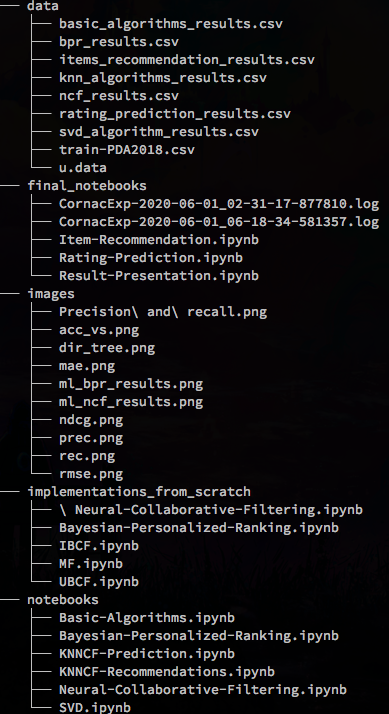
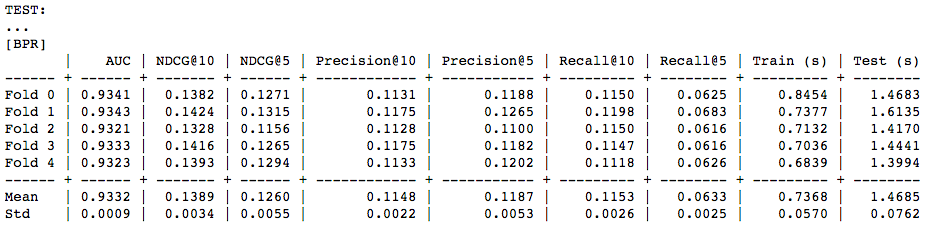
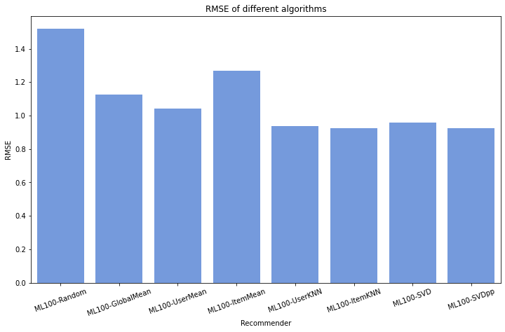
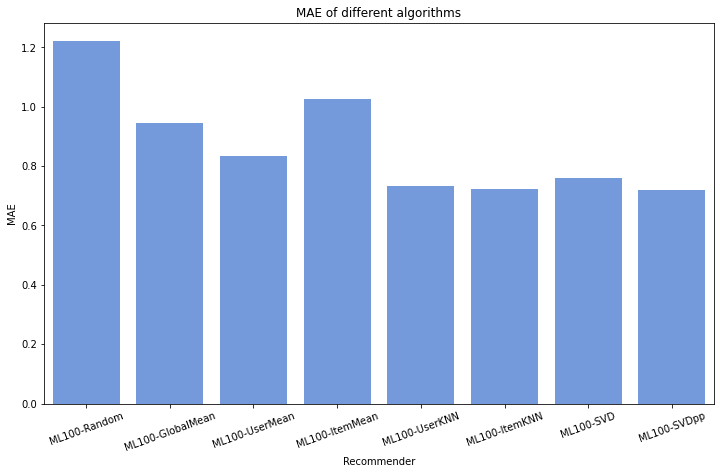
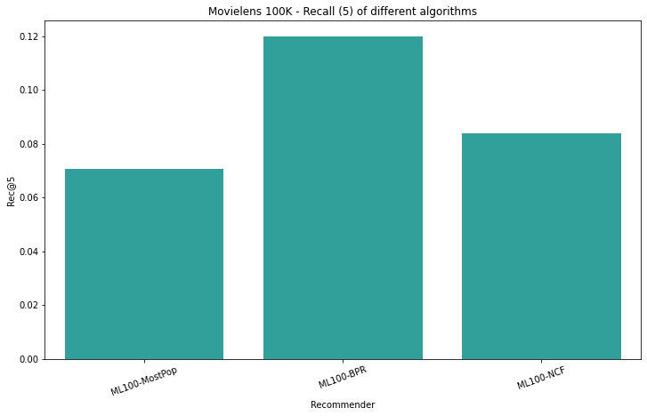
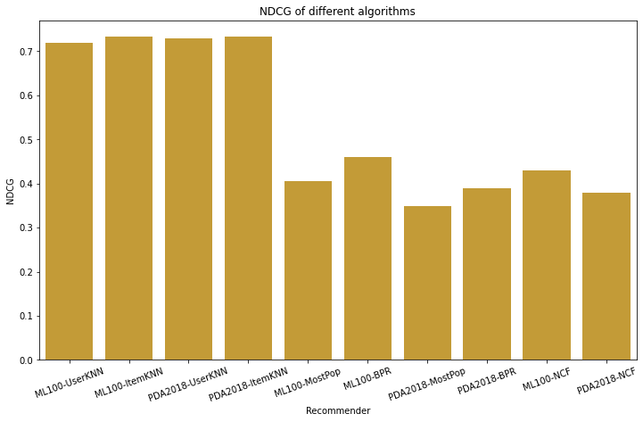

# RecSys 2019-2020 Final Project:
Evalutation and usage of various Rating prediction and Item Recommendation algorithms.

*By Geri Skenderi and Luca Bellinazzi.*

## Table of contents
- [RecSys 2019-2020 Final Project:](#recsys-2019-2020-final-project)
  - [Table of contents](#table-of-contents)
  - [Getting started](#getting-started)
    - [Prerequisites](#prerequisites)
    - [Installing the required packages](#installing-the-required-packages)
  - [Project structure](#project-structure)
  - [Results](#results)
    - [Rating Prediction (using Surprise)](#rating-prediction-using-surprise)
    - [Item Recommendation (using Cornac)](#item-recommendation-using-cornac)
    - [Item Recommendation (using our mixed Implementations)](#item-recommendation-using-our-mixed-implementations)
      - [Comments on the tasks and our results](#comments-on-the-tasks-and-our-results)
  - [Project structure](#project-structure-1)
  - [Project requirements](#project-requirements)
  - [Images](#images)

## Getting started

### Prerequisites
This project uses *pipenv* for dependency management and virtual environment management.

If you do not have pipenv installed you can install it using: 
- `brew install pipenv` 
- `pip install --user pipenv`

For other installation options check out [the pipenv installation docs](https://pipenv-fork.readthedocs.io/en/latest/install.html#installing-pipenv).

### Installing the required packages

!You can follow this procedure only after you have installed pipenv and cloned the repository!

Navigate to the root directory where the *Pipfile* is located. The *Pipfile* is where pipenv stores package information. To create a Python virtual environment and install all the packages simply run `pipenv install`.

After that process is finished you will see that a *Pipfile.lock* file has been created. The virtual environment with all the needed packages is now ready to use. You can access it by using `pipenv shell`. To exit the virtual environment simply use `exit`. 

Once the virtual environment is activated you can run any Python command you prefer. To access the notebooks, run the `jupyter-notebook` command and then the Jupyter window will open in your browser (by default in port 8888).

You can check examples and other commands you can use with pipenv by simply running `pipenv`.

## Project structure
There are 4 directories that make up this project:

1. **data**: This directory contains the movielens and PDA data as well as the results of our experiments in csv format
2. **implementations_from_scratch**: In here you can find our from-scratch implementations of some of the algorithms that we used. It was useful for us to see and understand how the algorithms and recommendation techniques worked on a low level before moving on to using various libraries.
3. **notebooks**: This directory contains the code divided by the category of the algorithms that we have used in this project. In each notebook there is a detailed implementation along with evaluation and most importantly **Grid Search** for the bigger models:
   1. Basic-Algorithms: Code for Random Predictios, User, Item and Global Mean Predictors using [Surprise](https://github.com/NicolasHug/Surprise)
   2. Bayesian-Personalized-Ranking: Implementation of BPR using [Cornac](https://github.com/PreferredAI/cornac)
   3. KNNCF-Prediction: Code for KNN Collaborative Filtering algorithms, used for *Rating Prediction*. Implemented using [Surprise](https://github.com/NicolasHug/Surprise)   
   4. KNNCF-Recommendations: Code for KNN Collaborative Filtering algorithms, used for *Item Recommendation*. Implemented using [Surprise](https://github.com/NicolasHug/Surprise)
   5. Bayesian-Personalized-Ranking: Implementation of NCF/NeuMF using [Cornac](https://github.com/PreferredAI/cornac)
   6. SVD: Implementation of SVD, a Matrix Factorization algorithms. Contains also code for SVD++. Implemented using [Surprise](https://github.com/NicolasHug/Surprise)
4. **final_notebooks**: This directory contains two notebooks, which contain the code for running all the different models, based on the task they were created for.
   1. **Rating-Prediction**: In this notebook you can run and experiment with all the *Rating Prediction* algorithms. The notebook generates a results table in the end which you can use to see how the various models perform and compare them to one-another.
   2. **Item-Recommendation**: In this notebook you can run and experiment with all the *Item Recommendation* algorithms. The notebook generates a results table in the end which you can use to see how the various models perform and compare them to one-another.

The code inside the notebooks is well documented and understandable. Because we use two libraries, the evaluation procedures are straightforward and are also done in the same way (with the exception of the KNNCF for Item Recommendation which is not evaluated in Cornac unlike all the other Item Recommendation models).

## Results
We have denoted the movielens dataset as ML100 and the PDA dataset as PDA2018.
Below follow the results of our work for this project. 

### Rating Prediction (using Surprise)
   
| Recommender        | RMSE  | MAE   | LibRec RMSE  | LibRec MAE   | 
|:-------------------|:------|:------|:-------------|:-------------|
| ML100-Random       | 1.527 | 1.228 | -            | -            |
| ML100-GlobalMean   | 1.126 | 0.945 | 1.126        | 0.945        |
| ML100-UserMean     | 1.042 | 0.835 | 1.042        | 0.835        |
| ML100-ItemMean     | 1.283 | 1.040 | 1.025        | 0.817        |
| ML100-UserKNN      | 0.939 | 0.733 | 0.944        | 0.737        |
| ML100-ItemKNN      | 0.922 | 0.721 | 0.924        | 0.723        |
| ML100-SVD          | 0.959 | 0.761 | 0.936        | 0.730        |
| ML100-SVDpp        | 0.924 | 0.720 | 0.912        | 0.718        |
| PDA2018-Random     | 1.481 | 1.185 | -            | -            |
| PDA2018-GlobalMean | 1.100 | 0.911 | -            | -            |
| PDA2018-UserMean   | 1.024 | 0.814 | -            | -            |
| PDA2018-ItemMean   | 1.204 | 0.979 | -            | -            |
| PDA2018-UserKNN    | 0.895 | 0.698 | -            | -            |
| PDA2018-ItemKNN    | 0.871 | 0.680 | -            | -            |
| PDA2018-SVD        | 0.908 | 0.717 | -            | -            |
| PDA2018-SVDpp      | 0.873 | 0.677 | -            | -            |

### Item Recommendation (using Cornac)

| Recommender     | Pre@5 | Pre@10 | Rec@5 | Rec@10 | NDCG |
|:----------------|:-------|:-------|:-------|:-------|:-------|
| ML100-MostPop   | 0.0945 | 0.0886 | 0.0431 | 0.0799 | 0.4056 |
| ML100-UserKNN   | 0.0002 | 0.0005 | 0.0002 | 0.0004 | 0.2856 |
| ML100-ItemKNN   | 0.0008 | 0.0010 | 0.0007 | 0.0017 | 0.2701 |
| ML100-BPR       | 0.1202 | 0.1131 | 0.0634 | 0.1188 | 0.4578 |
| PDA2018-MostPop | 0.0739 | 0.0701 | 0.0394 | 0.0697 | 0.3486 |
| PDA2018-UserKNN | 0.0002 | 0.0014 | 0.0004 | 0.0031 | 0.2625 |
| PDA2018-ItemKNN | 0.0046 | 0.0054 | 0.0014 | 0.0033 | 0.2473 |
| PDA2018-BPR     | 0.0962 | 0.0881 | 0.0569 | 0.1009 | 0.3904 |

### Item Recommendation (using our mixed Implementations)

| Recommender     | Pre@5 | Pre@10 | Rec@5 | Rec@10 | NDCG |
|:----------------|:------|:------|:------|:------|:------|
| ML100-UserKNN   | 0.353 | 0.360 | 0.320 | 0.477 | 0.719 |
| ML100-ItemKNN   | 0.345 | 0.348 | 0.306 | 0.452 | 0.733 |

#### Comments on the tasks and our results
- As it can be seen from the tables above the rating prediction task was successful. The implementations here worked well and by tweaking the libraries we obtained great results.

- Surely doubt will arise when looking at the item recommendation results from Cornac. The metric values are very low and they might seem wrong, but they actually aren't. It's the Cornac evaluation policy that makes them seem wrong. Actually, we can see from the results in the table that the trends are correct and valid. Precision decreses for greater values of k, Recall increases for greater values of k and BPR is the better approach when it comes to ranking. Here is  [an issue from the official Cornac repository](https://github.com/PreferredAI/cornac/issues/323) that discusses the topic of low metric values. Also [this one](https://github.com/PreferredAI/cornac/issues/324). You can also see in the code that the AUC values for all the models (we used the AUC metric in the code but didn't export it for evaluation) shows good results with BPR-AUC > NCF-AUC > MostPop-AUC. Again, we haven't exported the AUC values in the tables here, but you can see them and how they evolved during training in the [final_notebooks](final_notebooks/)

## Project structure
There are 4 directories that make up this project:

1. **data**: This directory contains the movielens and PDA data as well as the results of our experiments in csv format
2. **implementations_from_scratch**: In here you can find our from-scratch implementations of some of the algorithms that we used. It was useful for us to see and understand how the algorithms and recommendation techniques worked on a low level before moving on to using various libraries. The varous implementations include two KNN collaborative filtering algorithms (user and item based), an implementation of Matrix Factorization, Neural Collaborative Filtering and BPR based on Keras:
3. **notebooks**: This directory contains the code divided by the category of the algorithms that we have used in this project. In each notebook there is a detailed implementation along with evaluation and most importantly **Grid Search** for the bigger models:
   1. Basic-Algorithms: Code for Random Predictios, User, Item and Global Mean Predictors using [Surprise](https://github.com/NicolasHug/Surprise)
   2. Bayesian-Personalized-Ranking: Implementation of BPR using [Cornac](https://github.com/PreferredAI/cornac)
   3. KNNCF-Prediction: Code for KNN Collaborative Filtering algorithms, used for *Rating Prediction*. Implemented using [Surprise](https://github.com/NicolasHug/Surprise)   
   4. KNNCF-Recommendations: Code for KNN Collaborative Filtering algorithms, used for *Item Recommendation*. Implemented using [Surprise](https://github.com/NicolasHug/Surprise)
   5. Bayesian-Personalized-Ranking: Implementation of NCF/NeuMF using [Cornac](https://github.com/PreferredAI/cornac)
   6. SVD: Implementation of SVD, a Matrix Factorization algorithms. Contains also code for SVD++. Implemented using [Surprise](https://github.com/NicolasHug/Surprise)
4. **final_notebooks**: This directory contains three notebooks, one is just to create the charts you can see in the [images](#images) section and the other two contain the code for running all the different models, based on the task they were created for.
   1. **Rating-Prediction**: In this notebook you can run and experiment with all the *Rating Prediction* algorithms. The notebook generates a results table in the end which you can use to see how the various models perform and compare them to one-another.
   2. **Item-Recommendation**: In this notebook you can run and experiment with all the *Item Recommendation* algorithms. The notebook generates a results table in the end which you can use to see how the various models perform and compare them to one-another.

The code inside the notebooks is well documented and understandable. Because we use two libraries, the evaluation procedures are straightforward and are also done in the same way (with the exception of the KNNCF for Item Recommendation which is not evaluated in Cornac unlike all the other Item Recommendation models).

Here is a visual tree representation of the directories: 

## Project requirements
1. **Performing Grid-Search (points 1.1 and 2.1)**: To see the various Grid Search runs you can check out the single algorithm implementations in the [notebooks](notebooks/) directory. When single-handidly studying the algorithms we performed Grid search for hyperparameter tuning on most of them, while also running cross validation afterwards.
2. **Results of Prediction and Recommendation (1.2 and 2.2)**: To see the results of the recommender algorithms you can check out the complete implementations in the [final_notebooks](final_notebooks/) directory. They wrap up all the algorithms (divided by purpose as mentioned before) in one place and that's where the results in the two tables from our [Results](#results) table come from.

## Images
E.g of a NCF run on Movielens 100K: 

E.g of a BPR run on Movielens 100K: 

Precision and Recall graph: BPR vs MostPop: 

